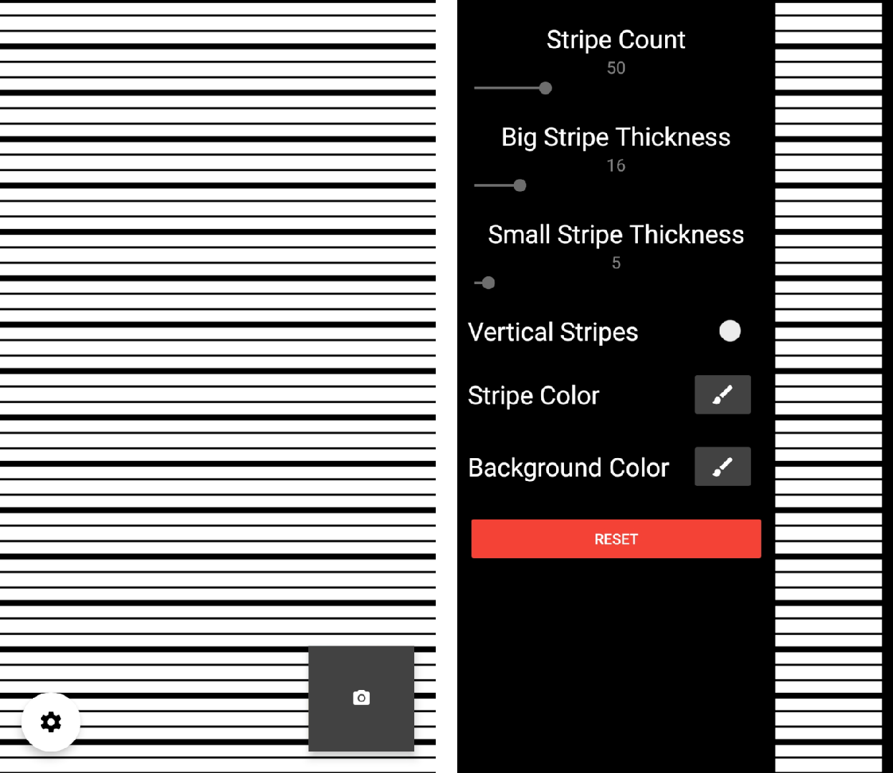

# Digital Dent Sail    

A simple Android app that helps you identify and capture dents in your car.

## Useful links

- [Releases](https://github.com/henkelmax/digital-dent-sail/releases)

## Features

- Preview image
- Image triggering with volume buttons and touchscreen
- Automatic brightness adjustment
- Automatic hiding of UI elements when taking an image
- Full stripe customization
- Image sharing and saving to gallery
- Dark mode compatible
- English and German language

